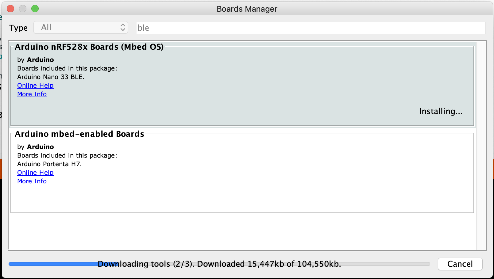
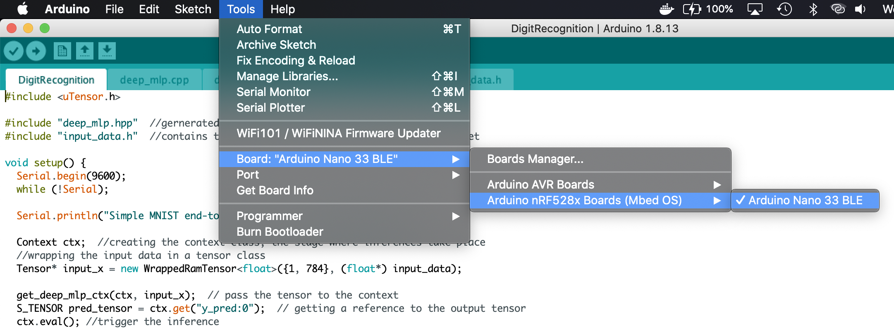

# Build Instructions

On Arduino IDE on MacOS

## Install the library
- Go to the Arduino library directory, for example:

```
/Users/<username>/Documents/Arduino/libraries/
```

- Clone the uTensor C++ runtime:

```bash
# using https
$ git clone https://github.com/uTensor/uTensor.git
# or using ssh
$ git clone git@github.com:uTensor/uTensor.git
```
- Checkout the right banch
```bash
$ cd uTensor
$ git checkout f/arduino
```

## Building the example

- Clone the example
```bash
$ git clone https://github.com/uTensor/utensor-arduino-demo.git
```

- Open `DigitRecognition.ino` under `utensor-arduino-demo/DigitRecognition` with Arduino IDE.
- Install board support via `Boards Manager` (`Tools` -> `Boards Manager`)
  - for example, you can install `Arduino Nano 33 BLE`

- Switch to the target board

- Click on `Verify`